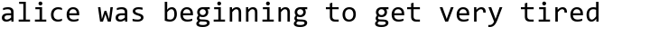

# Night Beam

我能去除文本的马赛克而不伤身体！

开发中……  
以下介绍都是未完成品的效果。


## 测试

+ 原文: alice was beginning to get very tired

+ 字体: consola

+ 字号: 32

+ 马赛克大小: 20

马赛克后: 


输入马赛克后的图，输出: 

```
azxa rulx kwgjfuing tsclpt very cenvd
allce was baqwxnxrg tsclpt very itnvd
alzce was begjfuecg to gfl very xinvd
aiice was kwypfasrg to ppt very itchd
alzce was baqarbing to ppt very tjvnd
aizce was baqwxnlng tsclpt very ztnnd
alzce was bdzprwvcg to get very tjvnd
alice was dauprbxrg to get very ssnnd
alice was baupfavcg to get very tlvnd
alice was bdzpnqrug to get very tjvnd
alice was baupening to get very ssnvd
alice was baupening to get very ztnvd
alice was bauprbing to get very cuhcm
alice was baqavwvcg to get very itnvd
alice was baupnikrg to get very cenvd
alice was baqynning to get very cennd
alice was baupening to get very tjvnd
alice was bauprbing to get very tjvnd
alice was baqarbing to get very tinvd
alice was begjfqrug to get very cennd
alice was begjvning to get very vxynd
alice was beginning to get very tjvnd
alice was beginning to get very vznnd
alice was beginning to get very ztred
alice was beginning to get very ztred
alice was beginning to get very ztred
alice was beginning to get very tjvnd
alice was beginning to get very tired

最终结果: alice was beginning to get very tired
```

这是马赛克之前的图片，内容完全一致: 

  

我果然是天才！


## 适用条件

+ 有马赛克后的文字截图

+ 知道原本文字的位置

+ 知道字号

+ 英文等宽字体

第一条基本都能满足，要是照片就没办法了。

第二、三条也好办，网页截图的话去原网页上按F12测一下就好了。

第四条比较苛刻，鬼知道哪个是等宽。刚好能撞上这个条件的，比如别人给代码截图的时候不是会把api_key之类的打上码……

如果不是等宽字体暂时没法解决……等我下次更新技术吧。


## 原理

我也不好说，随便起个名字就叫做非梯度下降暴搜瞎猜法……

首先随机猜测一个字符串。

对于每一个字符，可以知道它在马赛克之后影响哪些位置，根据这些位置与目标马赛克的差值可以得到字符与目标字符的差值。

以差值作权，每次随机变化可以使偏差变小的一个字符。在陷入极小值时后随机变化所有不正确的字符。

然后总有一天就可以复原出原本的文字了。

大概就是这样，详细的介绍以后再写吧。
