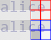

# Night Beam

我能去除文本的马赛克而不伤身体！

经常看到有去除图像和视频的马赛克的算法。这样不好，伤身体。

所以我发明了去除文本马赛克的算法！  
妈妈再也不用担心我对着视频里的女孩子〇〇了！

不过是一拍脑袋写出来的，还得再做一些深入的研究。一方面是稳定性可能并不好，另一方面是以后的性能可能还会加强。

## 效果

### 原文: alice was beginning to get very tired

+ 字体: consola

+ 字号: 32

+ 马赛克大小: 20

马赛克后: 

输入马赛克后的图，每轮的预测结果: 

> azxa rulx kwgjfuing tsclpt **very** cenvd  
> allce **was** baqwxnxrg tsclpt **very** itnvd  
> alzce **was** begjfuecg **to** gfl **very** xinvd  
> aizce **was** baqwxnlng tsclpt **very** ztnnd  
> alzce **was** bdzprwvcg **to** **get** **very** tjvnd  
> **alice** **was** dauprbxrg **to** **get** **very** ssnnd  
> **alice** **was** bauprbing **to** **get** **very** tjvnd  
> **alice** **was** begjvning **to** **get** **very** vxynd  
> **alice** **was** **beginning** **to** **get** **very** tjvnd  
> **alice** **was** **beginning** **to** **get** **very** **tired**  

(输出较多，省略了中间的18轮)

结果: alice was beginning to get very tired

这是马赛克之前的图片，与结果内容一致: 

.png)  

大成功！

## 原理

我也不好说，要起名字的话就叫做无梯度随机下降法。

### 图像结构

用alice举个例子: 

这个图片是拼出来的。它有两个图层，上面是字母alice，下面是马赛克。

而马赛克的每个块都只会受到少数几个字母的影响，比如e影响它临近的4格，而a影响它临近的2格。

### 矩阵

我们不知道字母是什么，所以不知道它确切地影响哪些格子。为了进行估计，我们预先将每个字母所在的位置涂黑，把黑色分散到附近的马赛克格子里。比如这里的e对上面两格的影响大，对下面两格的影响小，我们用黑色占那个格子的比例来量化。

我们把每个马赛克格子当作一个元素，然后把所有格子展平(flatten)。这样一来每个字母对每个格子的影响就可以组成一个二维矩阵，下面需要用到所以记作A。

### 字母损失

虽然是随机算法，但还得用到一些依据来获得合理的猜测速度。

首先从字符集里随机抽取字母，生成一个字符串，进行处理，可以得到一个另外的马赛克，同样进行分块、展平。
计算两个马赛克相减的平方，就能估计我们产生的新串与目标串的差距，我们把这看作损失(loss)。

然后把差距向量和矩阵A相乘，得到每个字母到目标字母的差距估计。当然这个猜测是不准确的，即使字母相同，也会因为旁边的字母的影响而产生差距。

以上图为例，如果我们发现新马赛克中\[2,4\](flatten之前)位置的块与输入块的差距很大，在乘上矩阵A之后，c和e的值就会上升，且c上升的多一些。这样我们就知道c可能是猜测错误的字母。

### 并没有梯度下降

虽然想用梯度下降法，问题是字母是离散的……似乎靠各种约束也可以完成，但是我不太有能做出来的自信。

接下来是真正的实现。用字母的差距作为权重，随机选择一个字母，尝试把它变化成另一个随机的字母，如果能使loss降低，就这么干，如果不能就再换其他的字母。

这个方法很容易就会陷入极小值，一旦出现，就把差距非0的字母全部随机重置，再回到选择字母的步骤。如果一个字母和它两侧的字母都是对的，那么它的loss应当几乎是0，这样可以在不破坏已经猜测出的完整单词的前提下重新初始化。

虽然看起来很蠢但是速度好像还可以。在我的废铜烂铁CPU(没错就是奔腾)上，使用单线程，解出alice那句话三次，分别用时339s、350s、225s。

## 适用条件

+ 有马赛克后的文字截图

+ 知道马赛克的起点和块大小

+ 知道原本文字的位置和字号

+ 英文等宽字体

第一条基本都能满足，要是照片就没办法了。

第二条自己用photoshop测一下就好了。

第三条也好办，网页截图的话去原网页上按F12测一下，其他的可能需要有类似的原文件。

第四条比较苛刻，鬼知道哪个是等宽。能撞上这个条件的，比如论坛上别人给代码截图的时候不是会把api_key之类的打上码……(所以说不要截图，你们都是饶罗翔和大主教教的吗)  
如果不是等宽字体暂时没法解决……等我下次更新技术吧。

## 其他样例

  

> nsrlcccf nov tcrdv thocc m **a** pltnzish  
> tsrirj h **not** **to** **be** thiw **is** **a** quescrpn  
> tsrio vv **not** **to** **be** thue **is** **a** qusotion  
> tsrio cf **not** **to** **be** thex **is** **a** quovsion  
> tsrlcrur **not** **to** **be** thue **is** **a** qusovzon  
> tscto cf **not** **to** **be** thex **is** **a** quskllzh  
> tsrio vv **not** **to** **be** thex **is** **a** qlwstion  
> tsctcccf **not** **to** **be** thue **is** **a** qusotion  
> **to** **be** vv **not** **to** **be** thiw **is** **a** qutnzion  
> **to** **be** **or** **not** **to** **be** thue **is** **a** qlwstion  
> **to** **be** **or** **not** **to** **be** thsk **is** **a** qusotion  
> **to** **be** **or** **not** **to** **be** **that** **is** **a** **question**  

结果: to be or not to be that is a question

  

> xhnz gtck brumx flk uegvu **over** nkcccouz bxg  
> tnw upick bvrph flk jdanz **over** hxccczej bxg  
> **the** upick brumx tnn jdjbs **over** **the** lsaj **dog**  
> thcrjuick brumcrnck jakps **over** **the** isaj **dog**  
> thcrjuick brodcrrlk jywbs **over** thnl jaj **dog**  
> **the** **quick** brean tnn jdxps **over** thcrzuuz **dog**  
> **the** **quick** bresh **fox** **jumps** **over** **the** **lazy** **dog**  
> **the** **quick** brooh **fox** **jumps** **over** **the** **lazy** **dog**  
> **the** **quick** bresh **fox** **jumps** **over** **the** **lazy** **dog**  
> **the** **quick** **brown** **fox** **jumps** **over** **the** **lazy** **dog**  

(输出较多，省略了中间的50轮)

结果: the quick brown fox jumps over the lazy dog